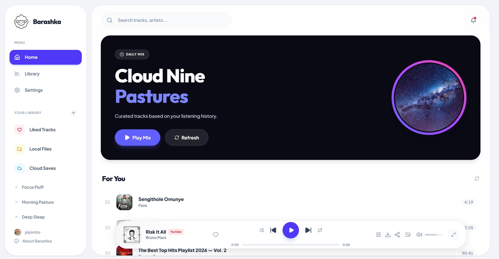
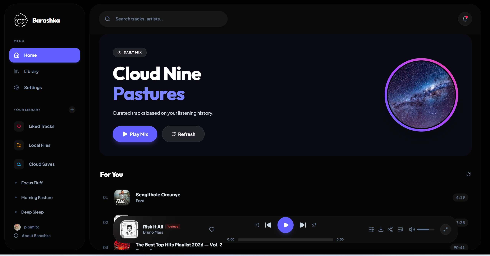
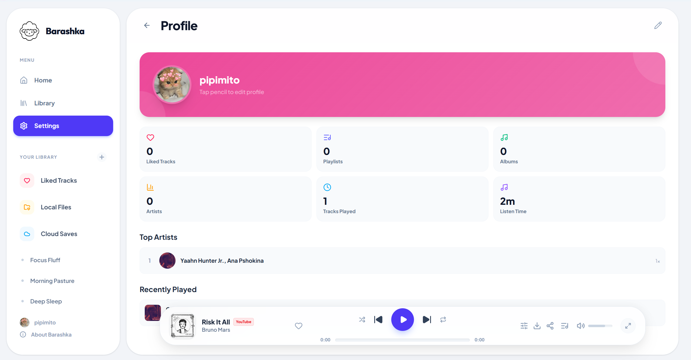

<p align="center">
   
</p>

# Barashka Music Player

> A minimalist music player for your collection. YouTube streaming and local files.

[](license)
[](https://nodejs.org/)
[](https://tauri.app/)
[](https://capacitorjs.com/)
[](https://github.com/Bebrowskiy/barashka/stargazers)

---

## About

Barashka is a music player built with React 19, TypeScript, Tailwind CSS 4, and Vite. It combines local file playback with streaming from YouTube. Works across web, desktop (Tauri), and mobile (Capacitor).

---

## Features

### Audio Playback

- Multiple formats: MP3, FLAC, WAV, OGG, M4A
- Hi-Res audio quality support
- Crossfade with configurable curves
- ReplayGain volume normalization
- 10-band equalizer
- Multiple visualizers

### Streaming Integration

- **YouTube** — Track streaming via Invidious API

### Library Management

- User playlists with full CRUD
- Playlist import/export (CSV, M3U, XSPF, JSPF, JSON)
- Favorites for tracks, albums, and artists
- Listening history

### Scrobbling

- Last.fm
- ListenBrainz
- Libre.fm
- Maloja (self-hosted)

### User Interface

- Minimalist, responsive design
- Light and dark themes
- Fullscreen player with lyrics (Genius API)
- Context menus with queue management
- Keyboard shortcuts
- i18n (English, Russian)

### Sync

- Cross-device sync via QR code / base64 export
- Syncs favorites, playlists, and history

### Desktop App (Tauri)

- Windows, macOS, Linux
- Discord Rich Presence

### Mobile App (Capacitor)

- Android and iOS
- Background playback, media controls

---

## Screenshots





---

## Quick Start

### Prerequisites

- **Node.js** >= 18.0.0
- **npm** >= 9.0.0

### Install

```bash
git clone https://github.com/Bebrowskiy/barashka.git
cd barashka
npm install
```

### Development

```bash
npm run dev
# App available at http://localhost:3000
```

### Production Build

```bash
npm run build

# Desktop app (Tauri)
npm run tauri:build

# Mobile apps (Capacitor)
npm run cap:sync
npm run cap:android   # or cap:ios
```

---

## Project Structure

```
barashka/
├── src/                        # React application
│   ├── App.tsx                 # Root component
│   ├── main.tsx                # Entry point
│   ├── types.ts                # TypeScript types
│   ├── index.css               # Global styles (Tailwind)
│   ├── context/                # React contexts
│   │   └── PlayerContext.tsx    # Global player state
│   ├── components/             # UI components
│   │   ├── MainView.tsx        # Home / search
│   │   ├── Sidebar.tsx         # Navigation sidebar
│   │   ├── Player.tsx          # Bottom player bar
│   │   ├── FullscreenPlayer.tsx
│   │   ├── LibraryView.tsx     # Library (playlists, favorites)
│   │   ├── PlaylistView.tsx    # Playlist detail
│   │   ├── ArtistView.tsx      # Artist page
│   │   ├── SettingsView.tsx    # Settings
│   │   ├── ContextMenu.tsx     # Right-click menu
│   │   └── ...
│   └── lib/                    # Utilities & services
│       ├── audio-engine.ts     # Playback engine
│       ├── music-api.ts        # Music API client
│       ├── youtube-api.ts      # YouTube provider
│       ├── db.ts               # IndexedDB CRUD
│       ├── scrobbler.ts        # Scrobbling router
│       ├── playlist-io.ts      # Import/export
│       ├── sync.ts             # Cross-device sync
│       ├── i18n.tsx            # Translations
│       ├── storage.ts          # LocalStorage settings
│       └── ...
├── public/                     # Static assets
├── src-tauri/                  # Tauri desktop app (Rust)
├── android/                    # Capacitor Android project
├── ios/                        # Capacitor iOS project
├── screenshots/                # App screenshots
├── index.html                  # HTML entry point
├── vite.config.ts              # Vite configuration
├── tsconfig.json               # TypeScript configuration
├── capacitor.config.json       # Capacitor configuration
└── package.json
```

---

## Technology Stack

| Technology | Purpose |
| --- | --- |
| React 19 | UI framework |
| TypeScript 5.8 | Type safety |
| Tailwind CSS 4 | Styling |
| Vite 6 | Build tool |
| Motion (Framer Motion) | Animations |
| Lucide React | Icons |
| IndexedDB | Local storage |
| Tauri 2.x | Desktop app (Rust) |
| Capacitor 8.x | Mobile app |

---

## Keyboard Shortcuts

| Action | Shortcut |
| --- | --- |
| Play/Pause | `Space` |
| Next Track | `Shift + ->` |
| Previous Track | `Shift + <-` |
| Volume Up | `Up` |
| Volume Down | `Down` |
| Toggle Lyrics | `L` |
| Toggle Queue | `Q` |

---

## License

Licensed under the [Apache License 2.0](license).

---

## Acknowledgments

- **[Tauri](https://tauri.app/)** - Desktop framework
- **[Capacitor](https://capacitorjs.com/)** - Mobile framework
- All open-source contributors

---

> _Listen the way you want._
